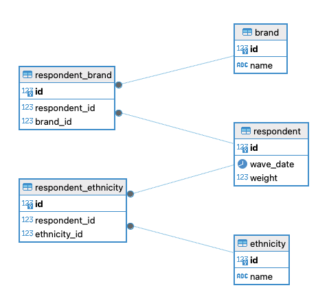

# Semantic Layer Modelling Problem

The intention of this repository is to build out a sample set of data that is a small representation of the kind of many-to-many issues that exist in the survey domain. You can run the example using the instructions below.

We want a semantic model which can generate a query like this:

```
WITH respondents AS (
    SELECT DISTINCT r.id AS respondent_id, r.weight, b.name AS brand_name
    FROM public.respondent r
    LEFT JOIN public.respondent_ethnicity re ON re.respondent_id = r.id
    LEFT JOIN public.ethnicity e ON e.id = re.ethnicity_id
    LEFT JOIN public.respondent_brand rb ON rb.respondent_id = r.id
    LEFT JOIN public.brand b ON b.id = rb.brand_id
    WHERE
        e.name IN ('Ethnicity D','Ethnicity C') AND r.wave_date = '2023-08-01'
),
respondents_base AS (
    SELECT DISTINCT respondent_id, weight
    FROM respondents
)
SELECT
    brand_name,
    SUM(r.weight) AS sum_weight,
    (SELECT SUM(weight) FROM respondents_base) AS total_weight,
    SUM(r.weight) / (SELECT SUM(weight) FROM respondents_base) AS percentage
FROM
    respondents r
GROUP BY
    brand_name
ORDER BY
    brand_name ASC;
```

From a model like this:



# Running the project with Docker

You'll first need to build and run the services via Docker (as defined in `docker-compose.yml`):

```bash
$ docker compose build
$ docker compose up
```

to destroy the db:

```bash
$ docker compose down
```

Connect to the database using your favourite SQL client on:

```
h: 127.0.0.1:5422
u: postgres
pwd: postgres
```

Connect to cube on: http://localhost:4000/#/
